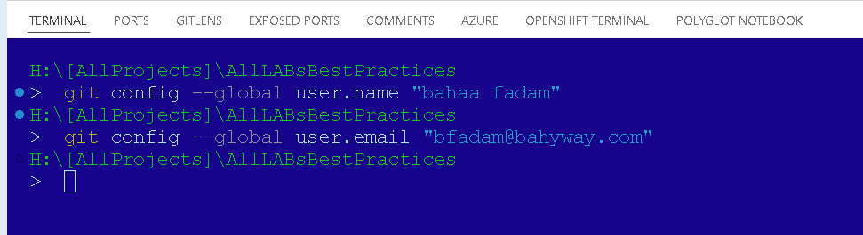

### Step-by-Step Guide to Sync with GitHub from VSCode

1. **Install Git and VSCode**

   * Ensure Git is installed on your system. You can download it from [git-scm.com](https://git-scm.com/).
   * Install Visual Studio Code if you haven't already. Download it from [code.visualstudio.com](https://code.visualstudio.com/).
2. **Configure Git**

   * Open a terminal and configure your Git username and email:
     <pre>

sh
<button class="flex gap-1 items-center"><svg xmlns="http://www.w3.org/2000/svg" width="24" height="24" fill="none" viewBox="0 0 24 24" class="icon-sm"><path fill="currentColor" fill-rule="evenodd" d="M7 5a3 3 0 0 1 3-3h9a3 3 0 0 1 3 3v9a3 3 0 0 1-3 3h-2v2a3 3 0 0 1-3 3H5a3 3 0 0 1-3-3v-9a3 3 0 0 1 3-3h2zm2 2h5a3 3 0 0 1 3 3v5h2a1 1 0 0 0 1-1V5a1 1 0 0 0-1-1h-9a1 1 0 0 0-1 1zM5 9a1 1 0 0 0-1 1v9a1 1 0 0 0 1 1h9a1 1 0 0 0 1-1v-9a1 1 0 0 0-1-1z" clip-rule="evenodd"></path></svg>Copy code</button>

<code class="!whitespace-pre hljs language-sh">git config --global user.name "Your Name"
     git config --global user.email "your-email@example.com"
     </code>

</pre>

   
3. **Push Changes to GitHub**

   1. Open the Command Palette (`Ctrl+Shift+P` or `Cmd+Shift+P` on Mac).
   2. Type `Git: Push` and select the command.
   3. If prompted, enter your GitHub credentials or set up an SSH key for authentication.

### Troubleshooting Common Issues

1. **Authentication Issues**
   * **Using HTTPS** : If you're using HTTPS to clone the repository, you might need to enter your GitHub username and personal access token (instead of your password).
   * Create a personal access token from [GitHub settings](https://github.com/settings/tokens).
   * Use the token as your password when prompted.
   * **Using SSH** : If you prefer using SSH, set up an SSH key and add it to your GitHub account.
   * Generate an SSH key (if you don't have one):
     <pre>

sh
<button class="flex gap-1 items-center"><svg xmlns="http://www.w3.org/2000/svg" width="24" height="24" fill="none" viewBox="0 0 24 24" class="icon-sm"><path fill="currentColor" fill-rule="evenodd" d="M7 5a3 3 0 0 1 3-3h9a3 3 0 0 1 3 3v9a3 3 0 0 1-3 3h-2v2a3 3 0 0 1-3 3H5a3 3 0 0 1-3-3v-9a3 3 0 0 1 3-3h2zm2 2h5a3 3 0 0 1 3 3v5h2a1 1 0 0 0 1-1V5a1 1 0 0 0-1-1h-9a1 1 0 0 0-1 1zM5 9a1 1 0 0 0-1 1v9a1 1 0 0 0 1 1h9a1 1 0 0 0 1-1v-9a1 1 0 0 0-1-1z" clip-rule="evenodd"></path></svg>Copy code</button>

<code class="!whitespace-pre hljs language-sh">ssh-keygen -t rsa -b 4096 -C "your-email@example.com"
     </code>

</pre>
   * Add the SSH key to your GitHub account by copying the content of the `id_rsa.pub` file to your GitHub SSH keys settings.
2. **Remote URL Configuration**
   * Ensure the remote URL is correctly configured.
   * Check the remote URL with:
     <pre>

sh
<button class="flex gap-1 items-center"><svg xmlns="http://www.w3.org/2000/svg" width="24" height="24" fill="none" viewBox="0 0 24 24" class="icon-sm"><path fill="currentColor" fill-rule="evenodd" d="M7 5a3 3 0 0 1 3-3h9a3 3 0 0 1 3 3v9a3 3 0 0 1-3 3h-2v2a3 3 0 0 1-3 3H5a3 3 0 0 1-3-3v-9a3 3 0 0 1 3-3h2zm2 2h5a3 3 0 0 1 3 3v5h2a1 1 0 0 0 1-1V5a1 1 0 0 0-1-1h-9a1 1 0 0 0-1 1zM5 9a1 1 0 0 0-1 1v9a1 1 0 0 0 1 1h9a1 1 0 0 0 1-1v-9a1 1 0 0 0-1-1z" clip-rule="evenodd"></path></svg>Copy code</button>

<code class="!whitespace-pre hljs language-sh">git remote -v
     </code>

</pre>
   * If needed, update the remote URL:
     <pre>

sh
<button class="flex gap-1 items-center"><svg xmlns="http://www.w3.org/2000/svg" width="24" height="24" fill="none" viewBox="0 0 24 24" class="icon-sm"><path fill="currentColor" fill-rule="evenodd" d="M7 5a3 3 0 0 1 3-3h9a3 3 0 0 1 3 3v9a3 3 0 0 1-3 3h-2v2a3 3 0 0 1-3 3H5a3 3 0 0 1-3-3v-9a3 3 0 0 1 3-3h2zm2 2h5a3 3 0 0 1 3 3v5h2a1 1 0 0 0 1-1V5a1 1 0 0 0-1-1h-9a1 1 0 0 0-1 1zM5 9a1 1 0 0 0-1 1v9a1 1 0 0 0 1 1h9a1 1 0 0 0 1-1v-9a1 1 0 0 0-1-1z" clip-rule="evenodd"></path></svg>Copy code</button>

<code class="!whitespace-pre hljs language-sh">git remote set-url origin git@github.com:username/repository.git
     </code>

</pre>
3. **Forking Issues**
   * If you are getting messages about needing to create a fork, it could be due to permissions on the repository.
   * Ensure you have write access to the repository.
   * If you are collaborating on a repository owned by someone else, ensure you are added as a collaborator.
4. **GitHub Extension for VSCode**
   * Install the official GitHub Pull Requests and Issues extension from the VSCode Marketplace.
   * This extension can simplify the process of managing pull requests and issues directly from VSCode.
5. **Sync Changes**
   * Use the `Sync Changes` button in the Source Control view to pull and push changes in one step.
   * Ensure there are no conflicts before syncing. If there are, resolve them and commit the resolution.

### Example Workflow

1. **Open a Terminal in VSCode** : `Ctrl+` or `Cmd+`.
2. **Navigate to Your Repository** :

<pre>

sh
<button class="flex gap-1 items-center"><svg xmlns="http://www.w3.org/2000/svg" width="24" height="24" fill="none" viewBox="0 0 24 24" class="icon-sm"><path fill="currentColor" fill-rule="evenodd" d="M7 5a3 3 0 0 1 3-3h9a3 3 0 0 1 3 3v9a3 3 0 0 1-3 3h-2v2a3 3 0 0 1-3 3H5a3 3 0 0 1-3-3v-9a3 3 0 0 1 3-3h2zm2 2h5a3 3 0 0 1 3 3v5h2a1 1 0 0 0 1-1V5a1 1 0 0 0-1-1h-9a1 1 0 0 0-1 1zM5 9a1 1 0 0 0-1 1v9a1 1 0 0 0 1 1h9a1 1 0 0 0 1-1v-9a1 1 0 0 0-1-1z" clip-rule="evenodd"></path></svg>Copy code</button>

<code class="!whitespace-pre hljs language-sh">cd path/to/your/repository
   </code>

</pre>

1. **Check Status** :

<pre>

sh
<button class="flex gap-1 items-center"><svg xmlns="http://www.w3.org/2000/svg" width="24" height="24" fill="none" viewBox="0 0 24 24" class="icon-sm"><path fill="currentColor" fill-rule="evenodd" d="M7 5a3 3 0 0 1 3-3h9a3 3 0 0 1 3 3v9a3 3 0 0 1-3 3h-2v2a3 3 0 0 1-3 3H5a3 3 0 0 1-3-3v-9a3 3 0 0 1 3-3h2zm2 2h5a3 3 0 0 1 3 3v5h2a1 1 0 0 0 1-1V5a1 1 0 0 0-1-1h-9a1 1 0 0 0-1 1zM5 9a1 1 0 0 0-1 1v9a1 1 0 0 0 1 1h9a1 1 0 0 0 1-1v-9a1 1 0 0 0-1-1z" clip-rule="evenodd"></path></svg>Copy code</button>

<code class="!whitespace-pre hljs language-sh">git status
   </code>

</pre>

1. **Stage Changes** :

<pre>

sh
<button class="flex gap-1 items-center"><svg xmlns="http://www.w3.org/2000/svg" width="24" height="24" fill="none" viewBox="0 0 24 24" class="icon-sm"><path fill="currentColor" fill-rule="evenodd" d="M7 5a3 3 0 0 1 3-3h9a3 3 0 0 1 3 3v9a3 3 0 0 1-3 3h-2v2a3 3 0 0 1-3 3H5a3 3 0 0 1-3-3v-9a3 3 0 0 1 3-3h2zm2 2h5a3 3 0 0 1 3 3v5h2a1 1 0 0 0 1-1V5a1 1 0 0 0-1-1h-9a1 1 0 0 0-1 1zM5 9a1 1 0 0 0-1 1v9a1 1 0 0 0 1 1h9a1 1 0 0 0 1-1v-9a1 1 0 0 0-1-1z" clip-rule="evenodd"></path></svg>Copy code</button>

<code class="!whitespace-pre hljs language-sh">git add .
   </code>

</pre>

1. **Commit Changes** :

<pre>

sh
<button class="flex gap-1 items-center"><svg xmlns="http://www.w3.org/2000/svg" width="24" height="24" fill="none" viewBox="0 0 24 24" class="icon-sm"><path fill="currentColor" fill-rule="evenodd" d="M7 5a3 3 0 0 1 3-3h9a3 3 0 0 1 3 3v9a3 3 0 0 1-3 3h-2v2a3 3 0 0 1-3 3H5a3 3 0 0 1-3-3v-9a3 3 0 0 1 3-3h2zm2 2h5a3 3 0 0 1 3 3v5h2a1 1 0 0 0 1-1V5a1 1 0 0 0-1-1h-9a1 1 0 0 0-1 1zM5 9a1 1 0 0 0-1 1v9a1 1 0 0 0 1 1h9a1 1 0 0 0 1-1v-9a1 1 0 0 0-1-1z" clip-rule="evenodd"></path></svg>Copy code</button>

<code class="!whitespace-pre hljs language-sh">git commit -m "Your commit message"
   </code>

</pre>

1. **Push Changes** :

<pre>

sh
<button class="flex gap-1 items-center"><svg xmlns="http://www.w3.org/2000/svg" width="24" height="24" fill="none" viewBox="0 0 24 24" class="icon-sm"><path fill="currentColor" fill-rule="evenodd" d="M7 5a3 3 0 0 1 3-3h9a3 3 0 0 1 3 3v9a3 3 0 0 1-3 3h-2v2a3 3 0 0 1-3 3H5a3 3 0 0 1-3-3v-9a3 3 0 0 1 3-3h2zm2 2h5a3 3 0 0 1 3 3v5h2a1 1 0 0 0 1-1V5a1 1 0 0 0-1-1h-9a1 1 0 0 0-1 1zM5 9a1 1 0 0 0-1 1v9a1 1 0 0 0 1 1h9a1 1 0 0 0 1-1v-9a1 1 0 0 0-1-1z" clip-rule="evenodd"></path></svg>Copy code</button>

<code class="!whitespace-pre hljs language-sh">git push origin main
   </code>

</pre>

* Replace `main` with the branch you are working on if it's different.

### Summary

By ensuring Git and VSCode are correctly configured, using proper authentication methods, and following a consistent workflow, you can smoothly sync files with GitHub from VSCode without issues. If problems persist, double-check your repository permissions and remote URL configurations, and consider using SSH for a more seamless authentication process.

4o
